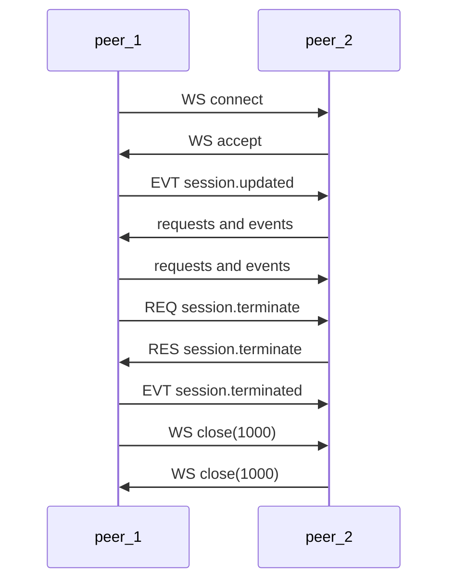
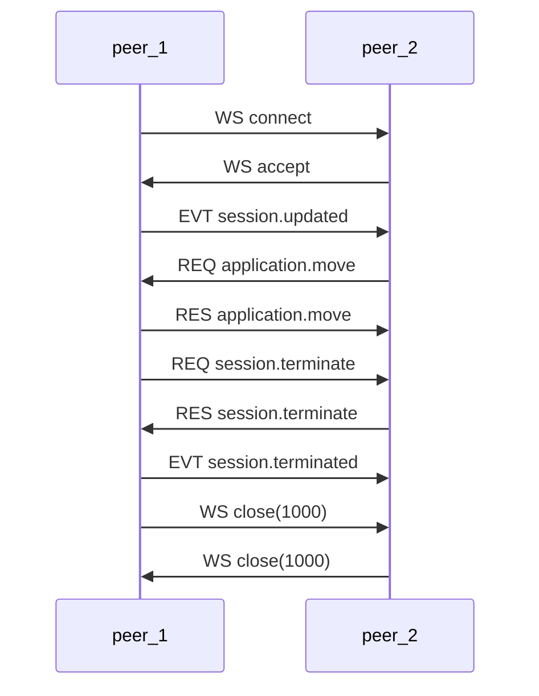

# RTVBP - Realtime Voice Bridge Protocol

> A lightweight session protocol for telephony service integration

---

`RTVBP` is a lightweight protocol which allows to integrate with babelforce
telephony services.

It allows an integrator to take control over an ongoing telephony session.

---

## Audio Format

- Currently only `PCM16` is supported at a sample rate of `8khz`
- We will send a continuous stream of audio without any gaps
- Peers can sent partial audio as well (You do not have to transmit silence)

## Protocol

`RTVBP` is a transport agnostic protocol which describes a bi-directional flow
of messages between two peers exchanging messages. `RTVBP` uses a `jsonrpc` like
envelope protocol which you can find [here](https://github.com/codewandler/fluxrpc/blob/main/src/fluxrpc-core/README.md)

### Websocket

One easy way to use `RTVBP` is by using websocket as transport protocol.

**Security**

A `RTVBP` websocket endpoint will be contacted only on `wss://` via `SSL` in production. `ws://` is not supported.
In order to secure your endpoint we allow to send any headers or reference a secret from the `babelforce` platform.
In addition we recommend some form of network layer IP whitelisting of our platform if you want to restrict access further.

The most common but secure use-case would be to use `Authorization: Bearer <secret()>`. This secret is managed by `babelforce`
and you only have to verify its correctness on your end. 

Individual messages during the conversation are not signed and do not have any security measure beside using `wss://`.
In the future message signing can be implemented.

**Keep-Alive**

When using websocket as transport protocol (which itself is based on HTTP - which is based on TCP)
typically no keep-alive (`ping` + `pong`) messages are needed on `RTVBP` level as this is already
taken care of from the transport layer. 

**Audio**

As websocket offers two message variants we chose the binary variant to transmit
audio data to reduce the frequent messages in their size by omitting the envelope.

## Example Flows

Here you find an example flow where `babelforce` acts as a client (`peer_1`) and connects to some external
party via websocket (`peer_2`). After a connection has been established - we speak more about a peer-to-peer
connection instead of a client-server relationship.

### Initialization and tear down



### Application Move

The following flow shows a full flow from initialization to termination

**Initialization**

`peer_1 -> peer_2`

```json
{
  "version": "1",
  "id": "g8ZiC0iYseCLgtL1NU0vk",
  "event": "session.updated",    
  "data": {
    "audio": {
      "channels": 1,
      "format": "pcm16",
      "sample_rate": 8000
    },
    "metadata": {    
      "recording_consent": true,
      "babelforce": {
        "call": {
          "id": "2z2BweAZsKxcbZuK0RMRi8C32gV",
          "session_id": "5000",
          "from": "681278817354",
          "to": "493010001000"
        }
      }
    }
  }
}
```

**Peer 2 requests to move the application**

`peer_2 -> peer_1`

```json
{
  "version": "1",
  "id": "U4s5Em1ZQnDnmuv89TXso",
  "method": "application.move",
  "params": {
    "application_id": "0000"
  }
}
```

**Response from peer_1**

`peer_1 -> peer_2`

```json
{
  "version": "1",
  "response": "U4s5Em1ZQnDnmuv89TXso",
  "result": {}  
}
```

**Peer 1 requests session termination**

```json
{
  "version": "1",
  "id": "Aoo-pVU_urrAEY93xacfk",
  "method": "session.terminate",
  "params": {
    "reason": "application.move"
  }
}
```

**Peer 2 confirms session termination**

`peer_2 -> peer_1`


```json
{
  "version": "1",
  "response": "Aoo-pVU_urrAEY93xacfk",
  "result": {}
  
}
```

**Final Message from peer 1**

`peer_1 -> peer_2`

```json
{
  "data": {},
  "event": "session.terminated",
  "id": "1hgD_V1PNq8pxQf9Nmova",
  "version": "1"
}
```



---

## Getting started

In order to implement clients we provide a simple testing
client which is able to connect to your server implementation.

**Get the code**

```bash
git clone https://github.com/babelforce/rtvbp.git
cd rtvpb
```

**Usage**

```text
Usage: rtvbp-demo client [OPTIONS] <COMMAND>

Commands:
  audio  Uses local audio for capture and playback
  agent  Use openAI to emulate a real person
  help   Print this message or the help of the given subcommand(s)

Options:
  -u, --url <URL>      Websocket URL to connect to [default: ws://127.0.0.1:8181]
  -t, --token <TOKEN>  Authorization Bearer Token which is set for websocket upgrade: `Authorization: Bearer {token}`
  -h, --help           Print help

```

### Use real audio

```bash
# run against a certain websocket endpoint
cargo run --bin rtvbp-demo -- client --url ws://127.0.0.1:8181 audio

# run against a certain websocket endpoint
cargo run --bin rtvbp-demo -- client --token="my_bearer_token" --url ws://127.0.0.1:8181 audio 
```

### Use OpenAI

Our test client is able to mimic a live call with a customer
by utilizing OpenAIs realtime voice model.

The best way currently to run the client is by using `cargo`
from within this project:

```bash
export OPENAI_KEY=s3cr3t
cargo run --bin rtvbp-demo -- client agent
```

**Example use-case**

```bash
cargo run --bin rtvbp-demo -- \
    client \
    --agent-prompt "you are an angry customer calling for a discount"
```

**Usage**

```bash
Usage: rtvbp-demo client agent [OPTIONS]

Options:
  -u, --url <URL>              [default: ws://127.0.0.1:8181]
  -t, --token <TOKEN>          Authorization Bearer Token Is set as HTTP header on handshake: `Authorization: Bearer {token}`
      --agent-speed <SPEED>    [default: 1.2]
      --agent-voice <VOICE>    [default: alloy]
      --agent-prompt <PROMPT>  [default: "You are a nice and friendly person wanting to have a nice conversation"]
      --agent-lang <LANG>      [default: en-US]
  -h, --help                   Print help
```

**Docker**

You can use docker to run the client.

Note: Unfortunately audio quality suffers when using in docker. This will be improved in the future.

```bash
# via docker
docker run \
    --rm \
    --net host \
    --env OPENAI_KEY=$OPENAI_KEY \
    --device /dev/snd -e AUDIODEV=default \
    --cap-add=sys_nice --ulimit memlock=-1 \
    ghcr.io/babelforce/rtvbp:main \
    client agent
```

### Server

An `rtvbp` client connects to a server.
To get started with a dummy server you can run our own test server:

```bash
docker run \
    --rm \
    --net host \
    --env OPENAI_KEY=$OPENAI_KEY \
    ghcr.io/babelforce/rtvbp:main \
    server
```

Please note that this server is also using OpenAI realtime
capabilities and therefore needs a valid `OPENAI_KEY`

You can also use other technologies to start a simple
server and run the test-client against it:

**websocat**

```bash
# On macOS
brew install websocat

# On Linux (via cargo)
cargo install websocat

# start a websocket server
websocat -s 8181
```

**NodeJS**

```js
const WebSocket = require('ws');
const wss = new WebSocket.Server({ port: 8181 });

wss.on('connection', ws => {
  console.log('Client connected');

  ws.on('message', message => {
    console.log(`Received: ${message}`);
  });

  ws.on('close', () => {
    console.log('Client disconnected');
  });
});
```

**Python**

```python
import asyncio
import websockets

async def echo(websocket, path):
    async for message in websocket:
        print(f"Received: {message}")

start_server = websockets.serve(echo, "localhost", 8080)
asyncio.get_event_loop().run_until_complete(start_server)
asyncio.get_event_loop().run_forever()
```


