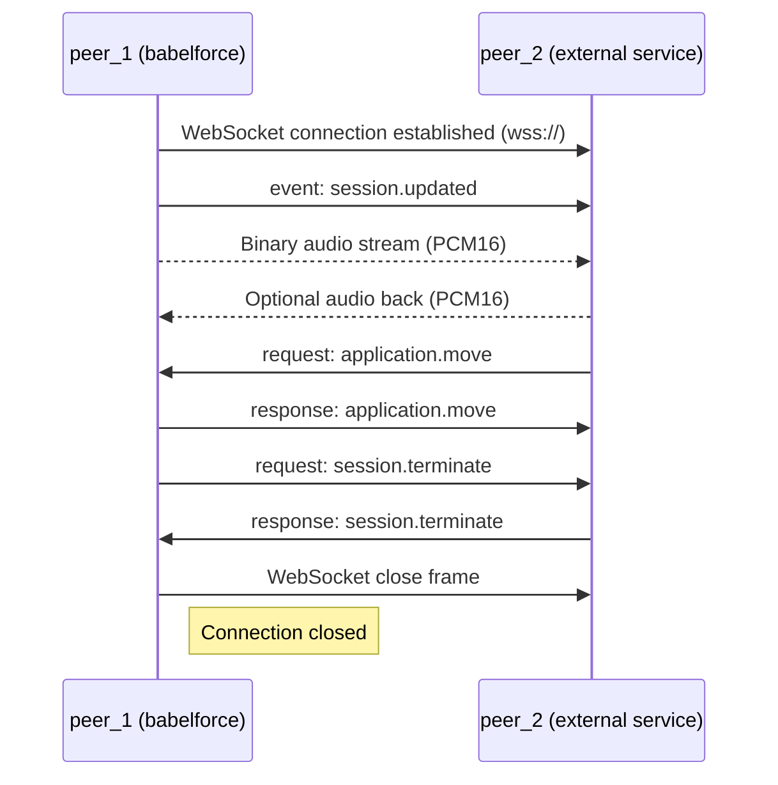

# RTVBP - Realtime Voice Bridge Protocol

> A lightweight session protocol for telephony service integration

---

`RTVBP` is a lightweight protocol which allows to integrate with babelforce
telephony services.

It allows an integrator to take control over an ongoing telephony session in the following ways:

- Receive the callers audio data in `PCM16` format
- Send audio data to the caller in `PCM16` format
- Get notified about various events (like `session.updated`, `call.hangup`, `dtmf.received`, etc )
- Execute commands (`session.terminate`, `call.hangup`, `dtmf.send`, `application.move`, etc)

---

## Audio Format

- Currently only `PCM16` is support
- We will sent a continuous stream of audio
- Peers can sent partial audio as well (You do not have to transmit silence)

## Protocol

`RTVBP` is a transport agnostic protocol which describes a bi-directional flow
of messages between two peers exchanging messages. `RTVBP` uses a `jsonrpc` like
envelope protocol which you can find [here](https://github.com/codewandler/fluxrpc/blob/main/src/fluxrpc-core/README.md)

### Websocket

One easy way to use `RTVBP` is by using websocket as transport protocol.

**Security**

A `RTVBP` websocket endpoint will be contacted only on `wss://` via `SSL` in production. `ws://` is not supported.
In order to secure your endpoint we allow to send any headers or reference a secret from the `babelforce` platform.
In addition we recommend some form of network layer IP whitelisting of our platform if you want to restrict access further.

The most common but secure use-case would be to use `Authorization: Bearer <secret()>`. This secret is managed by `babelforce`
and you only have to verify its correctness on your end. 

Individual messages during the conversation are not signed and do not have any security measure beside using `wss://`.
In the future message signing can be implemented.

**Keep-Alive**

When using websocket as transport protocol (which itself is based on HTTP - which is based on TCP)
typically no keep-alive (`ping` + `pong`) messages are needed on `RTVBP` level as this is already
taken care of from the transport layer. 

**Audio**

As websocket offers two message variants we chose the binary variant to transmit
audio data to reduce the frequent messages in their size by omitting the envelope.

## Example Flows

Here you find an example flow where `babelforce` acts as a client (`peer_1`) and connects to some external
party via websocket (`peer_2`). After a connection has been established - we speak more about a peer-to-peer
connection instead of a client-server relationship.

**Initialization**

After we (`peer_1`) connected to the external peer (`peer_2`) the following event is expected to be received at `peer_2`:

```json
{
  "event": "session.updated",
  "data": {
    "audio": {
        "format": "pcm16",
    },
    "metadata": {
        "call_id": "call-12345678",
        "recording_consent": true,        
    }    
  }
}
```

The `metadata` is a free form object which can be controlled via configuration
and populated with the help of `babelforce` session variables and expressions. 

After you have received this event you can expect to receive audio.

**Caller hangup**

If a caller hangs up the call on babelforce side (`peer_1`) - `peer_2` can expect the following events:

`event(call.hungup): peer_1 -> peer_2`

```json
{
  "event": "call.hungup",
  "data": {
    "call": {
        "id": "1234",
    },    
  }
}
```

`call` holds the standard babelforce call object as its known from the API.

When babelforce detects the hangup we send a message to request the graceful termination of the session:

`request(session.terminate): peer_1 -> peer_2`


```json
{
    "id": "req-1234",
    "method": "session.terminate",
    "data": {
      "reason": "call.hungup"
    }
}
```

`peer_2` acknowledges the request to terminate the session:

`response(session.terminate): peer_2 -> peer_1`

```json
{
  "response": "req-1234",
  "result": null
}
```

When we (`peer_1`) receive the response to a session termination request we will:

- websocket: send a final close frame
- close any underlying transport

**Call control: moving a call**

A call can be moved in two ways:
1. Continue in the next IVR application module
2. Continue in an application specified by its ID

Examples:

1. Continue in the after-flow of an IVR application:

`request(application.move): peer_2 -> peer_1`

```json
{
  "id": "req-1234",
  "method": "application.move",
  "params": "continue"
}
```

2. Move to a specific application by ID 

`request(application.move): peer_2 -> peer_1`

```json

{
  "id": "req-1234",
  "method": "application.move",
  "params": {
    "application": {"id": "1234"},
  }
}
```

When we see a request to `application.move` we reply like this:

`response(application.move): peer_1 -> peer_2`

```json
{
  "response": "req-1234",
  "result": {}
}
```

After that we initiate the `session.terminate` flow described earlier.

**Errors**

When sending a request and an error occurs you can expect a payload of the following shape:

```json
{
    "response": "req-1234",
    "error": {
        "code": 404,
        "message": "Application does not exist",
        "data": {
            "application_id": "1234"
        }
    }
}
```

---



---

## Getting started

In order to implement clients we provide a simple testing
client which is able to connect to your server implementation.

**Get the code**

```bash
git clone https://github.com/babelforce/rtvbp.git
cd rtvpb
```

**Usage**

```text
Usage: rtvbp-demo client [OPTIONS] <COMMAND>

Commands:
  audio  Uses local audio for capture and playback
  agent  Use openAI to emulate a real person
  help   Print this message or the help of the given subcommand(s)

Options:
  -u, --url <URL>      Websocket URL to connect to [default: ws://127.0.0.1:8181]
  -t, --token <TOKEN>  Authorization Bearer Token which is set for websocket upgrade: `Authorization: Bearer {token}`
  -h, --help           Print help

```

### Use real audio

```bash
# run against a certain websocket endpoint
cargo run --bin rtvbp-demo -- client --url ws://127.0.0.1:8181 audio

# run against a certain websocket endpoint
cargo run --bin rtvbp-demo -- client --token="my_bearer_token" --url ws://127.0.0.1:8181 audio 
```

### Use OpenAI

Our test client is able to mimic a live call with a customer
by utilizing OpenAIs realtime voice model.

The best way currently to run the client is by using `cargo`
from within this project:

```bash
export OPENAI_KEY=s3cr3t
cargo run --bin rtvbp-demo -- client agent
```

**Example use-case**

```bash
cargo run --bin rtvbp-demo -- \
    client \
    --agent-prompt "you are an angry customer calling for a discount"
```

**Usage**

```bash
Usage: rtvbp-demo client agent [OPTIONS]

Options:
  -u, --url <URL>              [default: ws://127.0.0.1:8181]
  -t, --token <TOKEN>          Authorization Bearer Token Is set as HTTP header on handshake: `Authorization: Bearer {token}`
      --agent-speed <SPEED>    [default: 1.2]
      --agent-voice <VOICE>    [default: alloy]
      --agent-prompt <PROMPT>  [default: "You are a nice and friendly person wanting to have a nice conversation"]
      --agent-lang <LANG>      [default: en-US]
  -h, --help                   Print help
```

**Docker**

You can use docker to run the client.

Note: Unfortunately audio quality suffers when using in docker. This will be improved in the future.

```bash
# via docker
docker run \
    --rm \
    --net host \
    --env OPENAI_KEY=$OPENAI_KEY \
    --device /dev/snd -e AUDIODEV=default \
    --cap-add=sys_nice --ulimit memlock=-1 \
    ghcr.io/babelforce/rtvbp:main \
    client agent
```

### Server

An `rtvbp` client connects to a server.
To get started with a dummy server you can run our own test server:

```bash
docker run \
    --rm \
    --net host \
    --env OPENAI_KEY=$OPENAI_KEY \
    ghcr.io/babelforce/rtvbp:main \
    server
```

Please note that this server is also using OpenAI realtime
capabilities and therefore needs a valid `OPENAI_KEY`

You can also use other technologies to start a simple
server and run the test-client against it:

**websocat**

```bash
# On macOS
brew install websocat

# On Linux (via cargo)
cargo install websocat

# start a websocket server
websocat -s 8181
```

**NodeJS**

```js
const WebSocket = require('ws');
const wss = new WebSocket.Server({ port: 8181 });

wss.on('connection', ws => {
  console.log('Client connected');

  ws.on('message', message => {
    console.log(`Received: ${message}`);
  });

  ws.on('close', () => {
    console.log('Client disconnected');
  });
});
```

**Python**

```python
import asyncio
import websockets

async def echo(websocket, path):
    async for message in websocket:
        print(f"Received: {message}")

start_server = websockets.serve(echo, "localhost", 8080)
asyncio.get_event_loop().run_until_complete(start_server)
asyncio.get_event_loop().run_forever()
```


