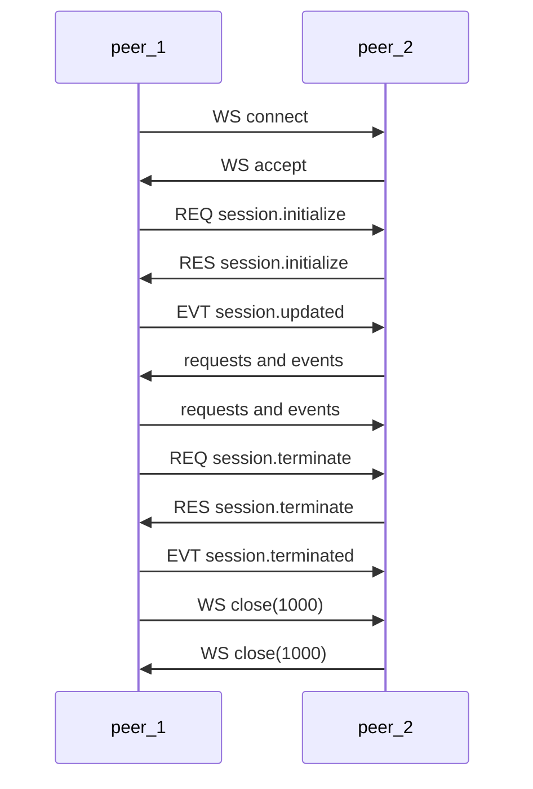

# Examples

---

## Session Lifecycle

```mermaid
sequenceDiagram
    participant peer_1
    participant peer_2

    peer_1->>peer_2: WS connect
    peer_2->>peer_1: WS accept
    peer_1->>peer_2: REQ session.initialize
    peer_2->>peer_1: RES session.initialize
    peer_1->>peer_2: EVT session.updated
    peer_2->>peer_1: requests and events
    peer_1->>peer_2: requests and events
    peer_1->>peer_2: REQ session.terminate
    peer_2->>peer_1: RES session.terminate
    peer_1->>peer_2: EVT session.terminated
    peer_1->>peer_2: WS close(1000)
    peer_2->>peer_1: WS close(1000)
```
