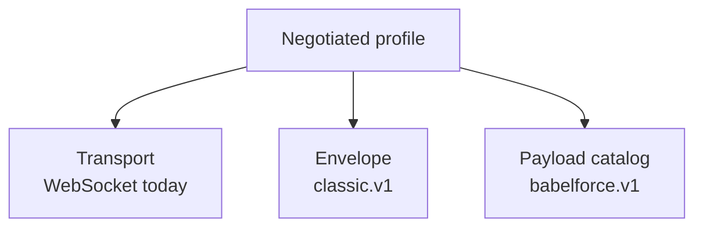

# Core concepts

## Roles are not client and server

RTVBP names peers by what they own, not by which side opened a socket:

:::note Naming rule
**Voice** and **application** describe protocol responsibility. **Client** and **server** describe
only who opened the selected transport connection.
:::

| Term | Meaning |
| --- | --- |
| Voice peer | Owns the telephone call, call control, and telephony-side audio. |
| Application peer | Runs an agent, IVR, or other realtime audio application. |
| Transport client | Opens the connection. In the deployed babelforce profile this is the voice peer. |
| Transport server | Accepts the connection. In the deployed babelforce profile this is the application peer. |
| Peer | Either side when direction is irrelevant. |

The generated [application](./reference/babelforce.v1/roles/application.mdx) and
[voice](./reference/babelforce.v1/roles/voice.mdx) role pages list exactly what each side implements,
calls, emits, and receives.

## Three independent layers

- The **catalog** defines operation and event meaning and payload shapes.
- The **envelope** correlates requests and responses and discriminates events.
- The **transport** carries complete control frames and realtime media.

Changing one layer does not redefine the others. See [Profiles and negotiation](./profiles.md).

## Control messages

- A **request** asks the peer to perform an operation and carries a unique ID.
- A **response** carries the corresponding request ID and either a result or an error.
- An **event** is a fire-and-forget notification with its own ID.

The generated [`classic.v1`](./reference/babelforce.v1/envelopes/classic-v1.mdx) page is the exact
JSON envelope contract, including frozen compatibility quirks. Generated operation and event pages
show payload-only JSON because the selected envelope supplies the outer frame.

## Media

The WebSocket binding uses text messages for enveloped JSON control and binary messages for audio.
The peers select the audio format during `session.initialize`; binary audio begins only after that
exchange succeeds. Control and media share one session but remain distinct channels in the runtime.

Start with the generated
[initialization flow](./reference/babelforce.v1/flows/initialize-updated-dtmf.mdx), then review the
[barge-in](./reference/babelforce.v1/flows/barge-in.mdx) and
[termination](./reference/babelforce.v1/flows/termination.mdx) flows.
