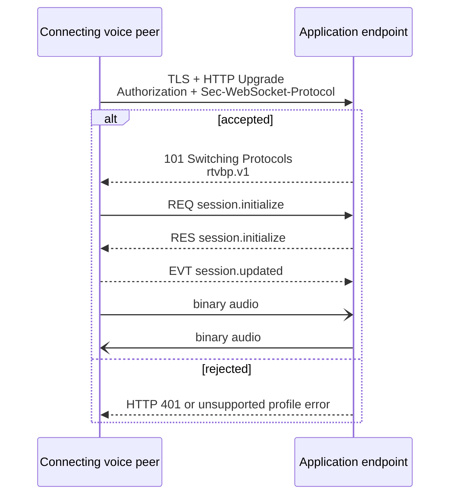

# Protocol implementation quickstart

Use this path when implementing RTVBP without the Go SDK.

## Implementation order

1. Accept a secure WebSocket and authorize the HTTP Upgrade before returning `101`.
2. Negotiate the `rtvbp.v1` profile as described in
   [Profiles and negotiation](../profiles.md).
3. Decode each text message with the generated
   [`classic.v1` envelope contract](../reference/babelforce.v1/envelopes/classic-v1.mdx).
4. Implement the generated [application](../reference/babelforce.v1/roles/application.mdx) or
   [voice](../reference/babelforce.v1/roles/voice.mdx) role.
5. Complete `session.initialize` before sending binary audio.
6. Correlate every request with exactly one response and preserve message ordering.
7. For terminal operations, flush the successful response before starting the WebSocket close
   handshake.

Run the generated conformance vectors under `conformance/<catalog>/` against your implementation.
The generated [flows](../reference/babelforce.v1/flows/initialize-updated-dtmf.mdx) are readable
projections of the same typed scenarios.
