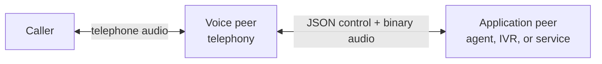

# Real-Time Voice Bridge Protocol

RTVBP connects a **voice peer**, which owns a live telephone call and its audio, to an
**application peer**, which listens, speaks, and controls the call. The peers exchange typed
operations and events alongside a real-time audio stream.

Typical applications include realtime AI agents, IVRs, language detection, acoustic monitoring,
quality analysis, transcription, and voice-driven workflows. RTVBP keeps the call in the telephony
platform while letting the application process and return audio with minimal protocol machinery.

The payload catalog is independent from its envelope and transport. A deployed connection selects
a [profile](./profiles.md): one transport, one envelope, and one payload catalog. This lets future
bindings use WebRTC, QUIC, or SIP without redefining the call-control protocol.

## Choose your path

- Using the Go SDK? Build a minimal endpoint in the [Go quickstart](./getting-started/go.md).
- Using the Rust SDK? Start with the [Rust quickstart](./getting-started/rust.md).
- Implementing the wire protocol yourself? Follow the
  [protocol quickstart](./getting-started/protocol.md).
- Integrating babelforce Cloud? Add the
  [babelforce authentication contract](./deployments/babelforce-cloud.md).
- Looking up a method, event, role, or tested flow? Open the generated `babelforce.v1` reference.

The [core concepts](./concepts.md) explain roles, transport client/server terminology, control
messages, media, envelopes, and profiles.

## Current profile

The deployed `rtvbp.v1` profile combines:

| Layer | Selection |
| --- | --- |
| Transport | WebSocket: JSON text control messages and binary audio |
| Envelope | [`classic.v1`](./reference/babelforce.v1/envelopes/classic-v1.mdx) |
| Catalog | `babelforce.v1` |

The catalog and envelope reference is generated from the same machine-readable specification that
produces SDK types and conformance fixtures. Sequence diagrams are generated from the same typed
scenarios executed by SDK conformance tests. Generated reference pages carry a DO-NOT-EDIT banner.
