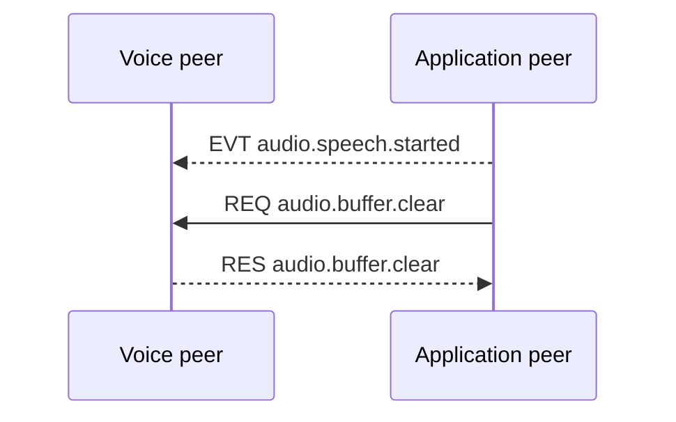

{/* Code generated by rtvbp-spec-gen from the typed protocol specification. DO NOT EDIT. */}

Stop queued application audio when new speech begins.

## Speech started clear buffer

The application signals speech detection and clears audio queued by the voice peer.

## Messages

- [`audio.buffer.clear`](../operations/audio.buffer.clear.mdx) — Discard buffered audio that has not yet been played.
- [`audio.speech.started`](../events/audio.speech.started.mdx) — Signal that speech started for barge-in handling.
