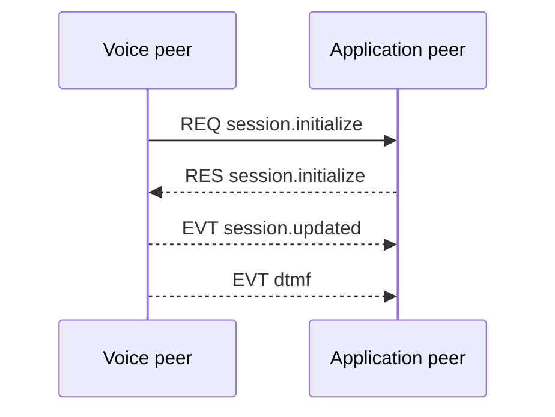

{/* Code generated by rtvbp-spec-gen from the typed protocol specification. DO NOT EDIT. */}

Initialize a voice session, publish the negotiated state, and deliver caller DTMF.

## Canonical

The voice peer offers audio, the application selects it, then receives session state and DTMF.

## Messages

- [`session.initialize`](../operations/session.initialize.mdx) — Negotiate the audio codec and initialize a real-time voice session.
- [`dtmf`](../events/dtmf.mdx) — Report a DTMF key after the remote caller releases it.
- [`session.updated`](../events/session.updated.mdx) — Report a change to negotiated session state such as the selected codec.
