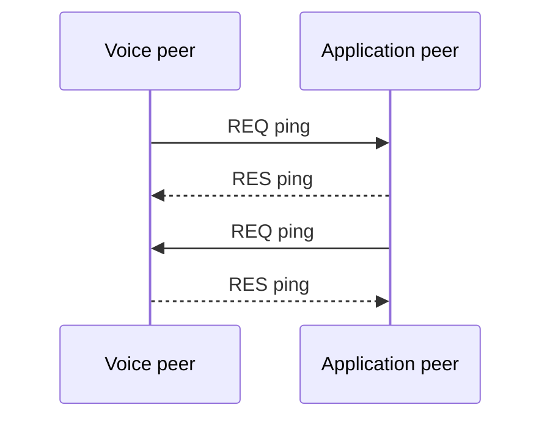

{/* Code generated by rtvbp-spec-gen from the typed protocol specification. DO NOT EDIT. */}

Measure application-layer timing independently of transport keepalive.

## Both directions

Each peer calls the bidirectional ping operation once.

## Messages

- [`ping`](../operations/ping.mdx) — Measure application-layer latency and optionally echo arbitrary data.
