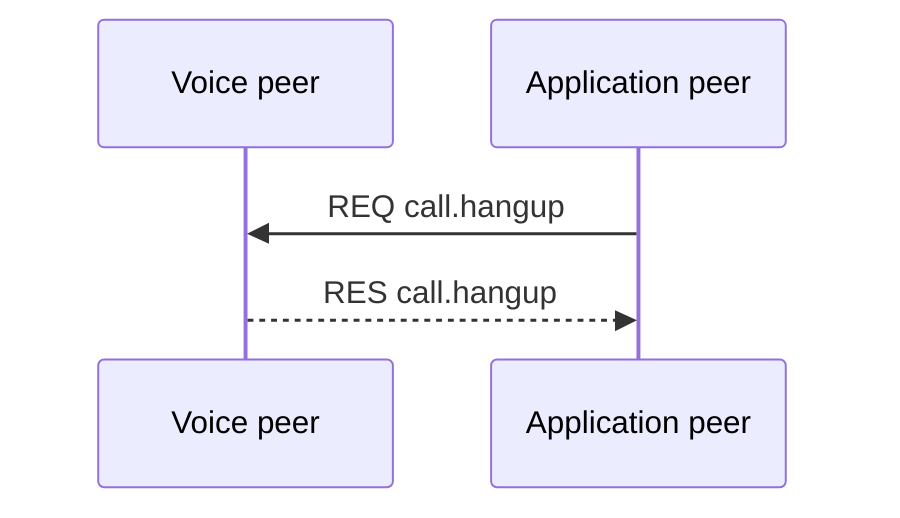
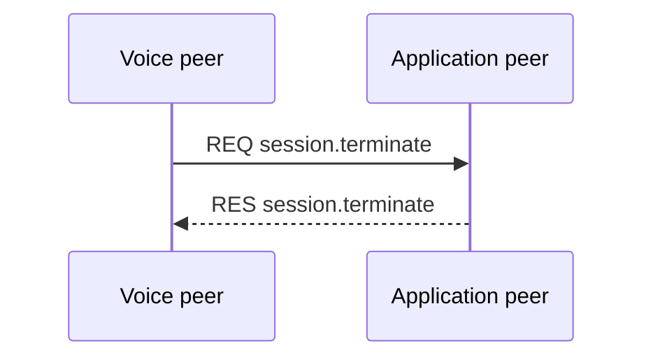
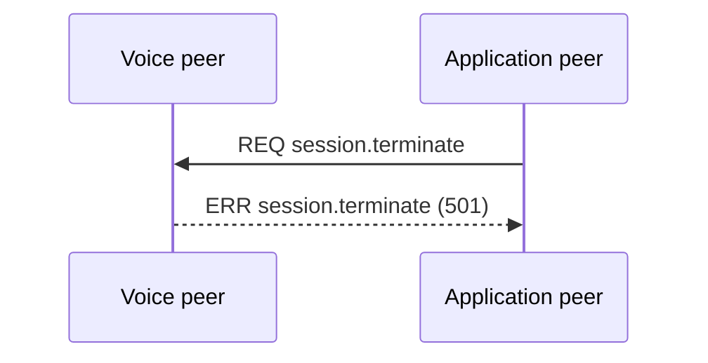

{/* Code generated by rtvbp-spec-gen from the typed protocol specification. DO NOT EDIT. */}

Close a session through the supported terminal operations and preserve the frozen reverse rejection.

## Application call hangup

The application asks the voice peer to hang up the telephony call.

## Voice session terminate

The voice peer asks the application to terminate the RTVBP session.

## Reverse session terminate rejection

The voice role rejects the frozen unsupported reverse session.terminate direction.

## Messages

- [`call.hangup`](../operations/call.hangup.mdx) — Hang up the telephony call after replying.
- [`session.terminate`](../operations/session.terminate.mdx) — Terminate the real-time voice session after replying.
