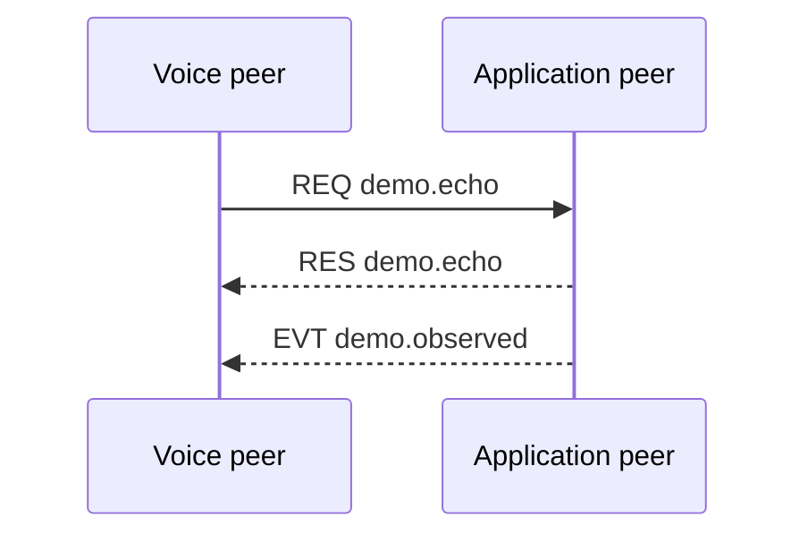

{/* Code generated by rtvbp-spec-gen from the typed protocol specification. DO NOT EDIT. */}

Echo one message and publish the observation from the application peer.

## Canonical

The voice peer calls demo.echo and receives a matching observation event.

## Messages

- [`demo.echo`](../operations/demo.echo.mdx) — Echo one message through the application peer.
- [`demo.observed`](../events/demo.observed.mdx) — Report that the application observed an echoed message.
