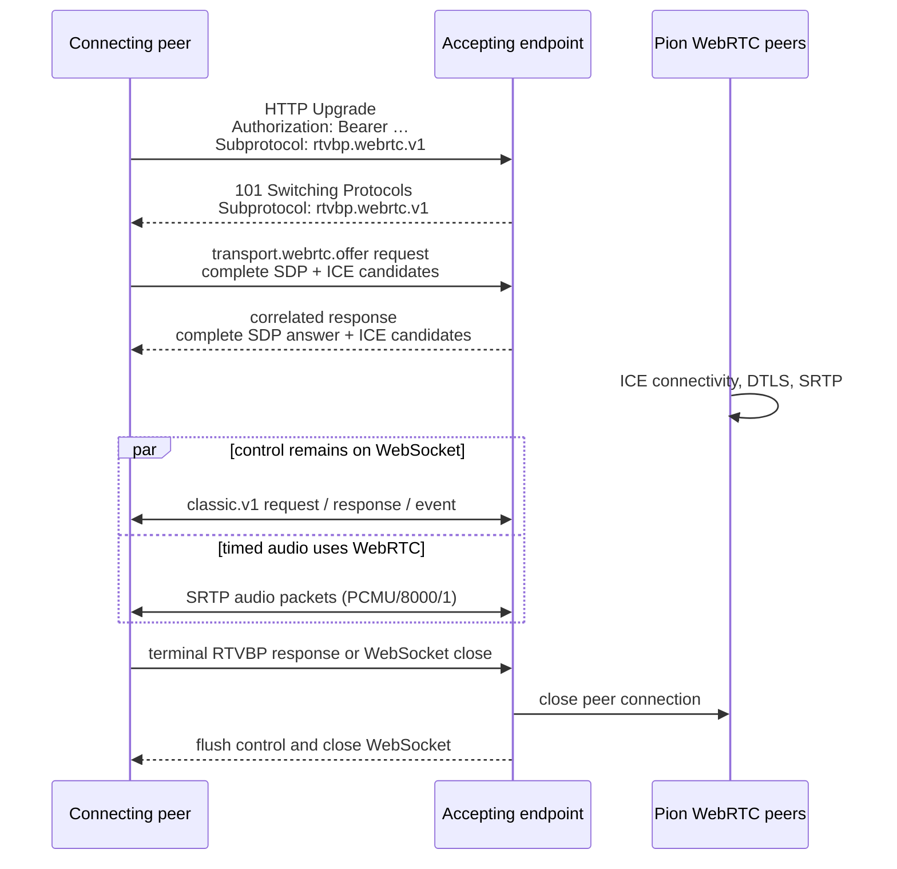

# WebRTC audio with WebSocket control

The `webrtcws.v1` binding adds timed WebRTC audio **alongside** the existing
[WebSocket binding](./websocket.md). It does not replace WebSocket binary audio. A client chooses at
connection setup:

| WebSocket subprotocol | Control | Audio |
| --- | --- | --- |
| `rtvbp.v1` | WebSocket text | WebSocket binary L16 |
| `rtvbp.webrtc.v1` | WebSocket text | WebRTC RTP PCMU |

Both bindings expose the same RTVBP operations, events, classic envelope, and SDK audio API.
An endpoint may offer both; a WebRTC-capable client explicitly offers `rtvbp.webrtc.v1`, while an
ordinary or headerless client continues to use `rtvbp.v1`.

## Connection flow



Authentication is evaluated before the WebSocket upgrade and therefore before SDP parsing, ICE,
or Pion peer creation. The bearer policy is deployment-specific, just as it is for the plain
WebSocket binding.

## Signaling

Initial SDP negotiation uses one reserved `transport.webrtc.offer` request and its correlated
response. These messages use the selected envelope, but the transport consumes them before the
session starts: they are not catalog operations and never reach an application handler.

`webrtcws.v1` uses non-trickle ICE. Each SDK waits for candidate gathering to complete and embeds the
candidates in SDP, so the initial exchange is bounded to one request and one response. SDP is
limited to 512 KiB and the complete signaling frame to 1 MiB. Do not log SDP in production because
it contains network addressing information.

## Audio formats

The WebRTC wire codec is **PCMU/8000/1** (RTP payload type 0), which WebRTC endpoints and browsers
support without a custom codec. The Go and Rust SDK boundary remains the frozen v1 format:

- signed 16-bit little-endian L16 PCM;
- 8,000 samples per second;
- one channel;
- 20 ms / 320 bytes per SDK frame.

The transport encodes each outbound L16 frame to a 160-byte G.711 mu-law sample and decodes inbound
PCMU back to L16. G.711 is lossy, so decoded samples need not equal the original PCM values. Incoming
media frames are timed from the RTP 8 kHz clock. The session's byte stream preserves that decoded
order while callers that use the media-channel layer can inspect PTS directly.

## Go configuration

Add WebRTC support to an existing server configuration; plain WebSocket audio remains enabled:

```go
base := ws.ServerConfig{
    Addr:        "0.0.0.0:8080",
    Path:        "/rtvbp",
    AudioFormat: l16Format,
}
server := ws.NewServer(webrtcws.AddToServer(base, webrtcws.Config{
    PeerConnection: pionConfig,
    AudioFormat:    l16Format,
}), handler)
```

Choose the binding on the client by selecting its session option:

```go
// Existing WebSocket-binary audio:
option := ws.Client(websocketConfig)

// Or WebRTC audio with the same WebSocket control configuration:
option = webrtcws.Client(webrtcws.ClientConfig{
    WebSocket:      websocketConfig,
    PeerConnection: pionConfig,
})
```

The existing compile-tested
[demo server](https://github.com/babelforce/rtvbp/tree/main/sdk/go/examples/rtvbp-demo-server)
offers both bindings. The matching
[demo client](https://github.com/babelforce/rtvbp/tree/main/sdk/go/examples/rtvbp-demo-client)
selects one with `-audio-transport websocket` or `-audio-transport webrtc`; its protocol, call,
DTMF, audio-device, and shutdown behavior is otherwise the same. The server's
`-preferred-audio-transport` flag controls selection order when a client offers both.

```bash
# Terminal 1: one server, both bindings
cd sdk/go/examples/rtvbp-demo-server
go run . -preferred-audio-transport webrtc

# Terminal 2: choose WebRTC (use "websocket" to choose the existing binding)
cd ../rtvbp-demo-client
go run . -audio-transport webrtc -sample-rate 8000
```

## Rust configuration

The Rust server advertises the WebRTC token alongside the classic fallback, then decorates only
connections that selected it:

```rust
let server = ws::Server::bind(webrtcws::add_to_server(server_config)).await?;
let base = server.accept().await?;
let transport = if base.wire_subprotocol() == webrtcws::SUBPROTOCOL {
    webrtcws::accept(base, envelope.clone(), webrtc_config).await?
} else {
    base
};
```

Clients choose either `ws::ClientFactory` or `webrtcws::ClientFactory`. Both implement the same
`TransportFactory` consumed by `Session`, so catalog handlers and audio-buffer code do not change.
See the [Rust SDK quickstart](../getting-started/rust.md) and its compile-tested dual-profile demo.

## ICE and deployment

The caller's Go Pion or Rust `webrtc::RTCConfiguration` controls ICE. Empty configuration is enough
for same-host and many direct-network tests. Production deployments normally provide STUN and
often TURN:

```go
webrtc.Configuration{ICEServers: []webrtc.ICEServer{{
    URLs:       []string{"stun:stun.example.com:3478", "turns:turn.example.com:5349"},
    Username:   turnUsername,
    Credential: turnCredential,
}}}
```

Supply TURN credentials through secret management and rotate them independently of WebSocket bearer
credentials. The demo pair reads comma-separated URLs from `RTVBP_ICE_SERVERS` and optional
`RTVBP_ICE_USERNAME` / `RTVBP_ICE_CREDENTIAL`; it contains no default public service or secret.

Allow the UDP/TCP paths required by the configured ICE servers and Pion candidates. A successful
WebSocket connection alone does not prove the media path is reachable.

## Current limitations

- one bidirectional audio channel named `audio`;
- PCMU only on WebRTC; no Opus yet;
- L16/8000/16-bit/mono/20 ms only at the SDK boundary;
- initial non-trickle ICE only; no renegotiation or ICE restart in `webrtcws.v1`;
- no packet-loss concealment in the transport.

Unsupported formats and duplicate media binding fail explicitly. WebRTC failure closes the media
channel and the session follows its normal failure path; orderly shutdown closes the WebRTC peer
and then flushes WebSocket control.
