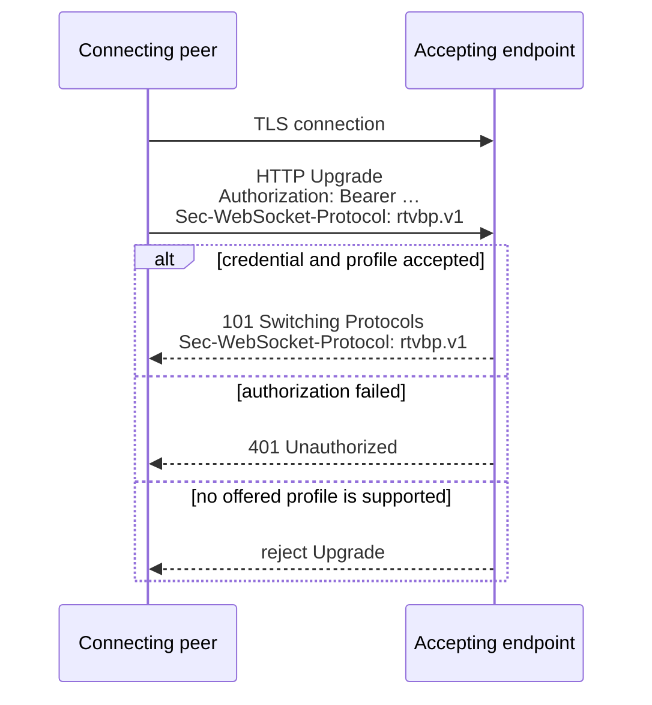

# WebSocket transport binding

The deployed binding carries one RTVBP session on one WebSocket connection, including audio as
binary messages. It remains available alongside the optional
[WebRTC-audio binding](./webrtc-websocket.md); callers choose one at connection setup. Production
endpoints use TLS (`wss://`). The connecting peer initiates an HTTP Upgrade and profile negotiation
follows the rules in [Profiles and negotiation](../profiles.md).

:::warning Production boundary
Authorize the HTTP Upgrade before returning `101`, require `wss://`, and never log bearer
credentials. No RTVBP session exists until admission and profile negotiation succeed.
:::



## Authentication

The connecting peer sends a bearer credential in the Upgrade request:

```http
Authorization: Bearer <token>
```

JWT signature, issuer, audience, expiry, key distribution, and rotation checks are deployment
policy rather than catalog or envelope semantics. Servers must validate the credential before
accepting an authenticated session.

The babelforce Cloud deployment uses a specific RS256 claim contract documented separately in
[babelforce Cloud authentication](../deployments/babelforce-cloud.md). Other deployments may use a
different bearer format or admission policy without changing the payload catalog.

Native browser WebSocket cannot add that header. Browser deployments can use same-origin cookies,
a deliberately scoped query credential, or a deployment-specific subprotocol carrier. The
TypeScript SDK documents babelforce's base64url OAuth carrier in the
[browser quickstart](../getting-started/typescript.md#browser-authentication-and-origin). Whatever
the credential carrier, an accepting browser endpoint must validate `Origin` before Upgrade; CORS
response headers are not a WebSocket Origin policy.

## Framing

| WebSocket message | RTVBP content |
| --- | --- |
| Text | One complete JSON control message encoded with the selected envelope |
| Binary | Audio bytes for the session's single duplex `audio` media channel |

Control and audio messages retain WebSocket ordering. Control JSON is never carried in binary
messages, and audio is never base64-encoded into control JSON.

The peers negotiate the audio codec through `session.initialize`. In `rtvbp.v1`, the deployed
format is fixed-width L16 PCM and the local binding uses 20 ms audio frames. A peer may send audio
only after initialization and codec selection complete.

## Liveness and closing

WebSocket Ping/Pong is the transport liveness mechanism. The catalog's `ping` operation is a
separate application timing measurement and is not an automatic keepalive.

For terminal operations, the response is sent and flushed before the transport closes. Normal
WebSocket close frames use the standard orderly-close handshake.
